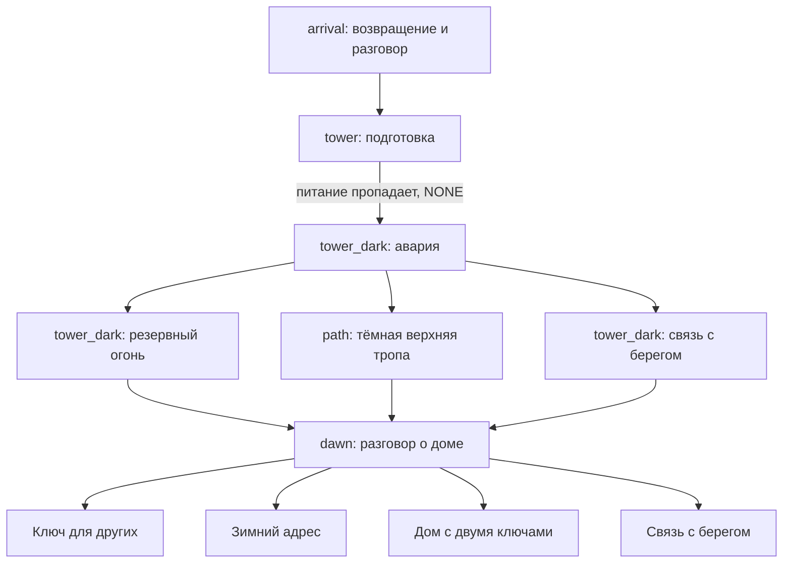

# «Пока горит маяк»

## Сюжет и персонажи

Герой приезжает на остров продать дом умершей матери. Его сестра Мира узнаёт, что оценщика прислали без её согласия. Разговор прерывает смотритель Лев: шторм пришёл раньше, питание маяка нестабильно, а рабочее судно «Вега» ещё в проливе.

Аварийная ночь не отменяет семейный конфликт. Она позволяет герою впервые разделить конкретную работу с сестрой. На рассвете они обсуждают дом и будущие обязательства. Три аварийных маршрута безопасно заканчиваются проводкой судна береговой службой; четыре концовки отвечают на отдельный вопрос — как семья будет жить дальше.

- **Герой, «Вы»** — взрослый старший брат Миры. Живёт в городе, привык решать проблемы организацией и деньгами. Без спрайта.
- **Мира** — 28 лет, работает в островной мастерской. Медная коса, синий дождевик, янтарный шарф. Не обязана немедленно простить брата или навсегда остаться на острове.
- **Лев** — 55 лет, смотритель маяка. Короткая седая борода, охристый дождевик, тёмный свитер. Привык держать всё на себе; после аварии признаёт необходимость остановки и ремонта.
- **Мать** присутствует в бытовых деталях и воспоминаниях. Тайного послания и предписанного детям решения нет.

## Подача текста

История сокращена и разбита на короткие страницы: одна мысль, реплика или действие. Всего **74 узла** в **6 логических сценах**; максимальная длина `text` — **235 символов с пробелами**, все страницы короче 300 символов. Длительность чтения не заявляется: её следует измерить на читателях.

Исходные идентификаторы сохранены на первых страницах. Продолжения получают суффиксы `_2` и `_3`; исходные choices/next перенесены на последнюю страницу. Camera, cameraStart, длительность и stageCharacters задаются только на первой странице, продолжения наследуют постановку. Это сохраняет плавность чтения без повторного запуска панорамы на каждом фрагменте.

`schemaVersion=2`, `id=lighthouse_last_light`. Две ранние развилки, три аварийных маршрута и четыре решения на рассвете дают **48 полных маршрутов**. Циклов, скрытых очков и блокировок условий нет. Все финалы доступны после любой аварийной ветви.

## Сцены, свет и персонажи

| Scene id | Ресурс фона | Состав |
|---|---|---|
| `arrival` | `files/scenes/island_arrival.png` | Пустое начало; появляется Мира, затем Лев |
| `tower` | `files/scenes/lighthouse_room.png` | Мира и Лев, маяк работает |
| `tower_dark` | `files/scenes/lighthouse_room_dark.png` | Тот же состав и мировые позиции, аварийное освещение |
| `path` | `files/scenes/storm_path_dark.png` | Только Мира, маяк на заднем плане погас |
| `dawn` | `files/scenes/harbor_dawn.png` | Мира и Лев; после ухода Льва остаётся Мира |
| `endings` | `files/scenes/harbor_dawn.png` | Пустой пейзаж, отдельная логическая сцена |

Спрайты: `files/characters/mira.png` и `files/characters/lev.png`. Мира всегда worldX=0.32, Лев — 0.68; groundY=0.9, scale=1. Position LEFT/RIGHT оставлен как fallback. Состав объявляется заново при входе в новую сцену. Если персонаж остаётся, его координаты не меняются от реплики к реплике.

На первых страницах реплик Миры и Льва камера использует targetCharacterId и обычно 1 100 мс. У их продолжений новых команд камеры нет. Рассказчик может переводить фокус на пейзаж; герой и рассказчик спрайтов не имеют. Все цели камеры видимы и имеют ресурс изображения.

Свет гаснет при переходе `tower/message_2` → `tower_dark/outage` с `nextSceneStartEffect=NONE`. На входе явно восстанавливаются оба персонажа. cameraStart и camera направлены на Льва, как перед отключением; duration=0. Меняется освещение фона, а не положение актёров или угол взгляда. Резервный огонь далее описан текстом: фон остаётся аварийным, отдельной анимации включения резерва нет.

Камера только горизонтальная. Проверять движение также в портретном окне с обрезаемым фоном: если весь фон помещается, горизонтальное смещение закономерно ограничено. Scale относится к спрайту, не к увеличению камеры.

## Маршруты приёмки и терминальные узлы

Каждый маршрут начинать новой игрой; промежуточные страницы проходить кнопкой продолжения.

| Маршрут | Выборы | Первая страница финала | Терминальный узел |
|---|---|---|---|
| A | Спросить о доме → спросить о тетради → резервный огонь → совместная продажа | `endings/sell_end` | `endings/sell_end_3` |
| B | Объяснить продажу → сразу помочь → береговой пост → вернуться на зиму | `endings/winter_end` | `endings/winter_end_3` |
| C | Спросить о доме → сразу помочь → остаться на связи → общий план на год | `endings/shared_end` | `endings/shared_end_3` |
| D | Любой вводный разговор → любая аварийная ветвь → помощь на расстоянии | `endings/distance_end` | `endings/distance_end_3` |

Эти прохождения покрывают все узлы. На `dawn/future` после каждого аварийного маршрута должны быть доступны четыре решения. Каждый финал занимает три короткие страницы; только третья имеет пустой choices и не имеет nextNodeId. Возврат в меню должен предлагаться после третьей страницы, а не по одному лишь имени сцены endings.

Концовки: совместная продажа без стирания памяти; пробный месяц на острове без обещания пожертвовать жизнью; сохранение дома на год с общими обязанностями; честная ограниченная помощь из города.

## Визуальные проверки

- `arrival/start` → `start_2`: вступительная панорама не перезапускается на коротком продолжении. Затем появляется Мира и камера наводится на неё.
- `arrival/lev` → `work` и `tower/charts` → `mira_work`: камера переходит между людьми, worldX не меняются.
- `tower/message_2` → `tower_dark/outage`: светлый фон мгновенно сменяется тёмным; оба персонажа сохраняют положение, камера остаётся у Льва. Весь текст после аварии находится в tower_dark.
- `tower_dark/reserve_start` → `reserve_start_2`: новая короткая страница сохраняет состав и не запускает повторно движение камеры.
- `path/path_start`: Льва нет, Мира объявлена заново, на дальнем плане нет работающего маяка.
- `dawn/mira_morning` → `alone`: Лев удалён; Мира остаётся на прежнем месте.
- `dawn/*_talk` → `endings/*_end`: персонажи исчезают, хотя ресурс фона прежний. Финальная панорама не перезапускается на `_2` и `_3`.
- Быстро продолжить во время панорамы или FADE: старая анимация не должна перезаписывать новую цель. Проверить крупный шрифт, портретное и широкое окно; короткий текст не заменяет проверки реального переноса строк.

## Статическая проверка

JSON проверяется с диска: длина каждого text, уникальность и совпадение идентификаторов, переходы, отсутствие циклов, достижимость всех 74 узлов и четыре терминальных узла. На всех 48 маршрутах проверяется видимость targetCharacterId с учётом наследования состава и сброса между сценами. PNG проверяются на существование.

Это не подтверждение визуального результата на устройстве. Эмулятор в рамках редактирования не запускался. Функции меню и возврата с финала проверяются отдельно от литературного сценария.

## Проверка сохранений и журнала

Автосохранение реализовано. Проверять `tower/book_2` (унаследованный состав), `tower_dark/outage` (смена фона без FADE), `path/path_truth` (только Мира), `dawn/alone` (Лев удалён), вторые и третьи страницы финалов. После закрытия приложения выбрать «Продолжить»: узел, worldX/groundY/scale и целевая камера должны восстановиться. Незавершённая панорама восстанавливается сразу в конечную позицию.

Открыть «Журнал»: в нём только открытые страницы и выбранные варианты, в порядке прохождения. Закрытие журнала не меняет страницу. Повторное продолжение не дублирует записи; новая игра очищает журнал после подтверждения. Общий host-тест восстанавливает каждую достижимую страницу новой ViewModel и сравнивает состояние, постановку и журнал. Реальное закрытие и перезапуск приложения проверяются вручную.
