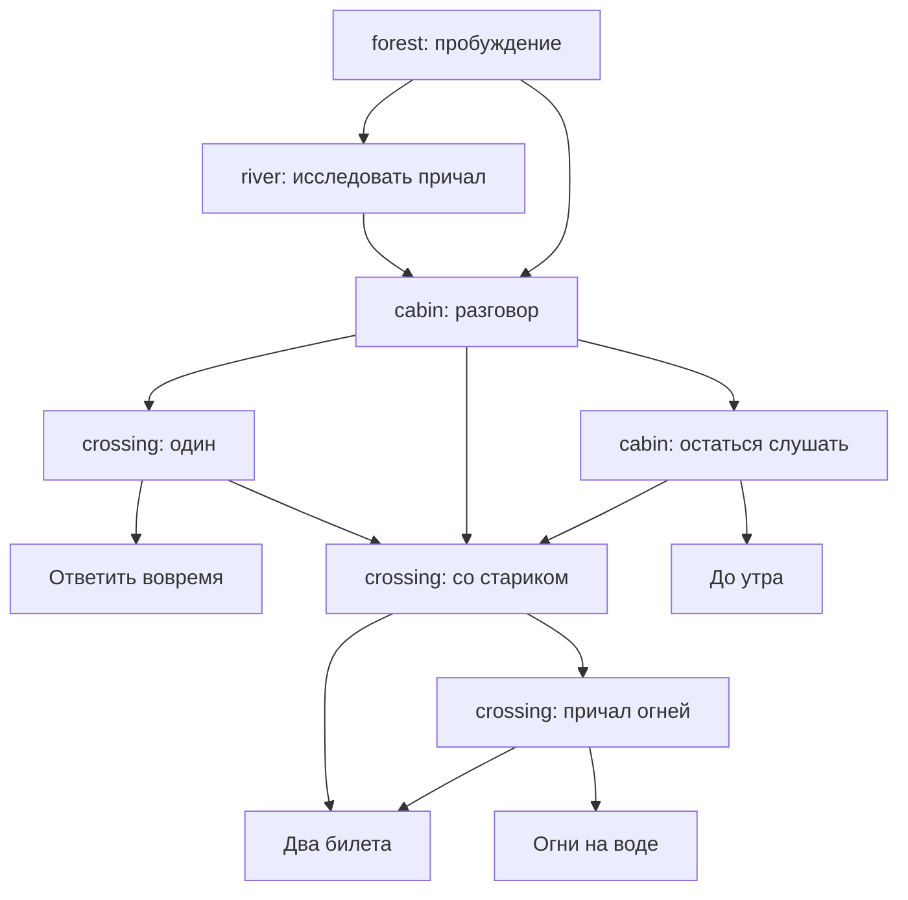

# «До третьего удара»: история и маршрут проверки

## Замысел

Герой опоздал к сестре и оказался у ночной реки. Перевозчик держит лодку на тросе: собственное невыполненное обещание превратил в обязанность бесконечно встречать других. До третьего удара колокола герой решает, вернуться ли одному, позвать старика, остаться слушать или помогать следующим путникам. Здесь нет наказания за «неправильный» выбор: концовки показывают разные способы отвечать за решения.

Встроенный `story.json` содержит 37 узлов, 5 сцен и 4 концовки. Используются только существующие forest, river, cabin, ending и old_man. Сцены `river` и `crossing` используют одинаковый фон при разных идентификаторах. История сохраняет прежний id `forest_mystery`; загрузчик не привязан к этому значению.

Это компактный законченный сценарий: около 1 445 слов во всём графе, ориентировочно 5–8 минут на маршрут с остановками на постановку. Требование 10–15 минут пока не выполнено; длительность надо измерить на читателях. Следующее расширение — отдельная сцена воспоминания у воды и разговор о сестре, а не повторение экспозиции.

## Граф

## Маршруты до всех концовок

Каждый маршрут начинать новой игрой. На линейных репликах нажимать «Далее»; ниже перечислены только выборы.

| Маршрут | Выборы | Конечный узел |
|---|---|---|
| 1. Домой одному | Свет хижины → как попасть домой → взять ключ → переправиться | `ending/home_end` |
| 2. Уйти вместе | Осмотреть берег → кольцо → почему старик остался → взять колокол → к станции | `ending/shared_end` |
| 3. Остаться слушать | Свет хижины → как попасть домой → остаться до утра → остаться | `ending/keeper_end` |
| 4. Зажечь огни | Осмотреть берег → надписи → почему старик остался → взять колокол → к цепочке огней → зажечь огни | `ending/beacon_end` |

Дополнительные ответвления для полного покрытия: ключ → окликнуть старика; остаться слушать → закончить разговор на другом берегу; цепочка огней → оставить фонарь и вернуться. Все узлы достижимы; циклов нет. В четырёх конечных узлах `choices: []`, нет `nextNodeId`; дальнейшее нажатие не должно менять состояние.

## Постановка и камера

| Узлы | Что проверить |
|---|---|
| `forest/start` | Первый кадр с `focusX=0`, движение к 1 за 5 с при запуске истории |
| `forest/bell` | Новый узел без cameraStart продолжает от текущего положения к 0.25 |
| `river/bank` | После FADE новая сцена начинает с 0.05 и движется к 0.95 за 4.2 с |
| `river/answer` | Панорама в обратную сторону: 0.95 → 0.1 за 1.8 с |
| `river/marks` | Нулевая длительность: мгновенное перемещение к 0.5 |
| `cabin/door` → `tea` | Старик LEFT, scale=0.85. В tea stageCharacters отсутствует: старик сохраняется |
| `cabin/question`, `keeper_reply`, `rules` | CENTER → RIGHT; scale=1 и 0.9; сохраняется один экземпляр персонажа |
| `cabin/lamp` | visible=false скрывает спрайт; одновременно камера идёт справа налево |
| `cabin/empty` | Явный пустой массив очищает состав сцены |
| `cabin/return` | Старик снова виден по центру, scale=1.05 |
| `cabin/decision` → `crossing/alone` | Сброс персонажа при переходе выбором: на новом берегу никого нет |
| `cabin/release` → `crossing/together` | Сброс при линейном переходе: первая реплика без спрайта, в together_board он появляется справа |
| `crossing/together_board` → `midstream` | Отсутствие stageCharacters сохраняет старика во время панорамы |
| `crossing/shared_trip` → `ending/shared_end` | На финальном фоне старик сбрасывается без явного пустого массива |
| `cabin/stay_choice` → `ending/keeper_end` | Переход выбором с NONE: без затемнения, но со сбросом персонажа и собственной камерой |

Проверять в портретной ориентации с горизонтально обрезаемым фоном: если изображение целиком помещается по ширине, изменение focusX закономерно не создаёт заметной панорамы. Камера меняет только focusX; zoom, вертикальный фокус и масштабирование фона сценарий не предполагает. scale относится к спрайту, не к камере.

На длинной панораме нажать «Далее» до её завершения: новый узел не должен ждать старую анимацию или получать её устаревшее конечное положение. Повторить переход сцены до завершения FADE. Эти проверки требуют запуска приложения; статическая проверка JSON их не заменяет.

## Покрытие логики

- Линейные переходы внутри сцены и между сценами; варианты выбора внутри сцены и между сценами; FADE и NONE; терминальные узлы.
- На выборе `crossing/alone_choice/depart` задано `conditions: {resolve: 0}`: неизвестная переменная равна нулю, поэтому путь открыт. Это проверка успешного условия без несуществующей механики изменения переменных.
- Посещённые узлы проверять по состоянию движка: после ухода из forest/start множество содержит `forest/start`; после перехода в river/bank оно содержит прежний узел, но не обязано сразу содержать текущий. Визуального журнала пока нет.
- Не добавлены заблокированные варианты с положительным порогом: интерфейс и изменение переменных ещё предстоит реализовать.

## Будущие проверки после пунктов 3–4

1. Ввести resolve и trust. Честный ответ повышает trust один раз, уклонение снижает; порог совместного пути проверяется ниже, ровно на и выше границы. Одиночный путь остаётся доступным всегда.
2. Предметы key и bell сделать взаимоисключающим выбором. Проверить, что загрузка и повторное открытие реплики не выдают предмет второй раз и не дублируют изменение переменной.
3. Сохранить `cabin/tea`, где спрайт унаследован, а не задан в узле. После перезапуска старик должен остаться слева с scale=0.85.
4. Сохранить `cabin/lamp` и `cabin/empty`: после загрузки скрытый персонаж не появляется. Сохранить crossing/midstream: старик справа, текущая сцена и переменные восстановлены.
5. Определить политику восстановления камеры во время движения: восстановить текущую позицию или итоговую. Проверять выбранный контракт отдельно от восстановления текста.
6. Автосохранение после выбора должно содержать целевой узел и применённые последствия атомарно. Прерывание приложения во время FADE не возвращает старый выбор и не применяет последствия повторно.
7. Новая игра очищает переменные, посещения и постановку. Сохранение от другой версии истории получает понятную обработку; четыре концовки корректно восстанавливаются как завершённые.

## Границы этого артефакта

Это сюжет и ручная матрица приёмки, а не подтверждение сборки Android/iOS. На обеих платформах отдельно проверить длинные реплики, переносы строк финала, крупный системный шрифт, быстрые нажатия и возврат из фона. CI, звук, сохранения, изменение переменных и новые графические материалы в рамках этой истории не добавлены.
